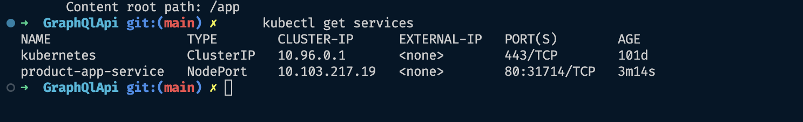

SOURCE: https://medium.com/@jaydeepvpatil225/graphql-introduction-and-product-application-using-net-core-bd37faf3c585


##### Serve the app
http://localhost:5217/graphql/

##### Query
productList
```graphql
query {
  productList {
    id
    productName
    productStock
    productDescription
    productPrice
  }
}
```


##### Mutation
deleteProduct
```graphql
mutation($productId:UUID!){
  deleteProduct(productId: $productId)
}
```
```json
{
  "productId": "1"
}
```


##### Add Product
addProduct
```graphql
mutation($productDetails:ProductDetailsInput!){
  addProduct(productDetails: $productDetails)
}
```
```json
{
    "productDetails": {
        "id": "939d05f4-86ae-11ee-b9d1-0242ac120002",
        "productName": "Product 1",
        "productStock": 10,
        "productDescription": "Product 1 Description",
        "productPrice": 10.0
    }
    }
```

##### Update Product
updateProduct
```graphql
mutation($productDetails:ProductDetailsInput!){
  updateProduct(productDetails: $productDetails)
}
```
```json
{
    "productDetails": {
        "id": "939d05f4-86ae-11ee-b9d1-0242ac120002",
        "productName": "Product 1",
        "productStock": 10,
        "productDescription": "Product 1 Description",
        "productPrice": 10.0
    }
    }
```

##### GET Single Product
product
```graphql
query($productId:UUID!){
  productDetailsById(productId: $productId){
    id
    productName
    productStock
    productDescription
    productPrice
  }
}
```

```json
{
    "productId": "939d05f4-86ae-11ee-b9d1-0242ac120002"
}
```

---

##### Docker
Docker is a platform for developers and sysadmins to build, run, and share applications with containers.

##### Kubernetes
Kubernetes is an open-source container-orchestration system for automating computer application deployment, scaling, and management.
Benefits of Kubernetes
- Service discovery and load balancing : No need to modify your application to use an unfamiliar service discovery mechanism. Kubernetes gives Pods their own IP addresses and a single DNS name for a set of Pods, and can load-balance across them.
- Storage orchestration : Automatically mount the storage system of your choice, such as local storages, public cloud providers, and more.
- Automated rollouts and rollbacks: Kubernetes progressively rolls out changes to your application or its configuration, while monitoring application health to ensure it doesn't kill all your instances at the same time. If something goes wrong, Kubernetes will rollback the change for you. Take advantage of a growing ecosystem of deployment solutions.
- Automatic bin packing : Automatically places containers based on their resource requirements and other constraints, while not sacrificing availability. Mix critical and best-effort workloads in order to drive up utilization and save even more resources.
- Self-healing : Restarts containers that fail, replaces and reschedules containers when nodes die, kills containers that don't respond to your user-defined health check, and doesn't advertise them to clients until they are ready to serve.
- Secret and configuration management : Deploy and update secrets and application configuration without rebuilding your image and without exposing secrets in your stack configuration.

The docker file should be in the same folder as the .csproj file of the project
#### Build docker image
```bash
docker build -t web-api .
```

#### Run docker image
```bash
docker run -d -p 2323:80 --name web-api-container web-api
```

##### logs
```bash
docker logs web-api-container
```

##### Explanation
- -d: Run the container in detached mode (in the background)
- -p: Publish a container’s port(s) to the host
- 2323:80: Map TCP port 80 in the container to port 2323 on the Docker host
- — name: Assign a name to the container
- web-api: Name of the image to run
- web-api-container: Name of the container

Dummy: Map port 2323 on your local machine to port 80 on the container. You can then browse to http://localhost:2323 to view the app.


#### Execute docker image
```bash
docker exec -it web-api-container bash
```

#### Stop docker image
```bash
docker stop web-api-container
```

#### Remove docker image
```bash
docker rm web-api-container
```

#### Remove docker image
```bash
docker rmi web-api
```

##### Force remove docker image
```bash
docker rmi -f web-api
```

#### List docker images
```bash
docker images
```

#### List docker containers
```bash
docker ps
```

#### List docker containers
```bash
docker ps -a
```

#### List docker containers
```bash
docker ps -a
```

##### Launch the app 
http://localhost:2323/swagger/index.html

Note: To see the swagger UI you need to add the following code in the Startup.cs file
```csharp
// Configure the HTTP request pipeline.
// if (app.Environment.IsDevelopment()) // comment this line
// { // comment this line
    app.UseSwagger();
    app.UseSwaggerUI();
// } // comment this line
```


Deployment.YAML

```yml
apiVersion: apps/v1
kind: Deployment
metadata:
  name: product-app-deployment  # Name of the deployment
spec:
  replicas: 3  # Number of desired replicas (pods)
  selector:
    matchLabels:
      app: product-app  # Label selector to match pods controlled by this deployment
  template:
    metadata:
      labels:
        app: product-app  # Labels applied to pods created by this deployment
    spec:
      containers:
        - name: product-app  # Name of the container
          image: web-api:latest  # Docker image to use
          imagePullPolicy: Never
          ports:
            - containerPort: 80  # Port to expose within the pod
```

Service.yml

```yml
apiVersion: v1
kind: Service
metadata:
  name: product-app-service  # Name of the service
spec:
  selector:
    app: product-app  # Label selector to target pods with this label
  ports:
    - protocol: TCP
      port: 80
      targetPort: 80
  type: NodePort  # Type of service (other options include 
```

#### Deploy the app
```bash
kubectl apply -f deployment.yml
kubectl apply -f service.yml
```

##### List pods
```bash
kubectl get pods
```

#### List deployments
```bash
kubectl get deployments
```

#### List services
```bash
kubectl get services
```

##### Logs
```bash
kubectl logs product-app-deployment-5549b5749c-lchl2 
```


##### Launch the app
http://localhost:31714/swagger/index.html


source : [src](https://medium.com/@jaydeepvpatil225/containerize-the-net-core-7-web-api-with-docker-and-kubernetes-9dd23e392936)

#### Delete deployment
```bash
kubectl delete deployment product-app-deployment
```

#### Delete service
```bash
kubectl delete service product-app-service
```

#### Delete all
```bash
kubectl delete all --all
```
